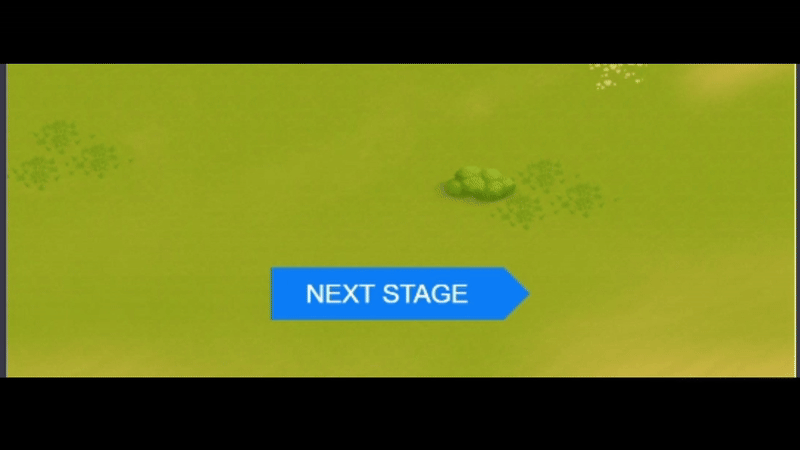

# Проект: Тестовое задание на позицию `Playable Ads Developer`

## Обзор

* Описание проекта
* Что использовалось?
* Как запустить?

## **Описание проекта**

Репозиторий для тестового задания, включающий реализацию ключевых фич для Playable Ads

В приложении есть несколько стадий:

* `1 стадия:` фоновая картинка, лого, кнопка перехода в стор, кнопка перехода

* `2 стадия:` происходит зум фоновой картинки, появляется поле фишек, где по свайпу фишки могут меняться метами

* `3 стадия:` поле фишек исчезает и появляется персонаж, запускается анимация персонажа

* `4 стадия:` происходит отзум и поверх персонажа проигрывается анимация фейерверков

* Если игрок в течение 3-х секунд не взаимодействует с экраном, то появляется `подсказка`

* По кнопке `play` происходит переход на страницу загрузки игры на [IOS](https://apps.apple.com/us/app/cradle-of-empires-match-3-game/id738480930) или [Android](https://play.google.com/store/apps/details?id=com.awem.cradleofempires.andr&hl=en)

## **Что использовалось?**

* HTML
* CSS
* TypeScript
* Pixi
* Spine
* Brandi
* Webpack

## **Как запустить?**

Создать .env файл по примеру, запустить приложение локально - **npm run start**, создать сборку **npm run build**.
